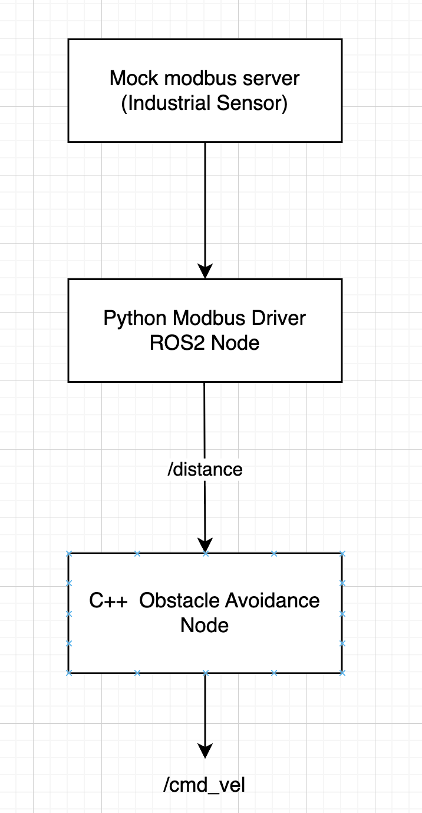
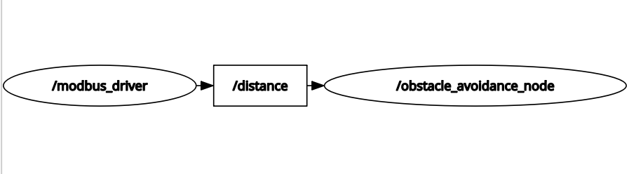

# ROS2 Modbus TCP Sensor Integration Demo

This project demonstrates a modular ROS2 Jazzy robotic system integrating an industrial-style Modbus TCP sensor driver with an obstacle avoidance pipeline.

The system separates hardware communication from robot behavior using ROS2 topics, enabling scalable and hardware-independent software integration.

## Skills Demonstrated

- ROS2 Jazzy development
- ROS2 publishers/subscribers
- QoS policy configuration
- Industrial communication (Modbus TCP)
- Hardware abstraction layer design
- Mixed-language ROS2 integration (Python + C++)
- Launch file orchestration
- Parameterized node configuration
- Modular robotics software architecture
- Debugging and integration testing

## System Architecture



## ROS2 Graph



## Installation

```bash
mkdir -p ~/ros2_ws/src
cd ~/ros2_ws/src

git clone <repo>

cd ~/ros2_ws

colcon build --symlink-install
source install/setup.bash
